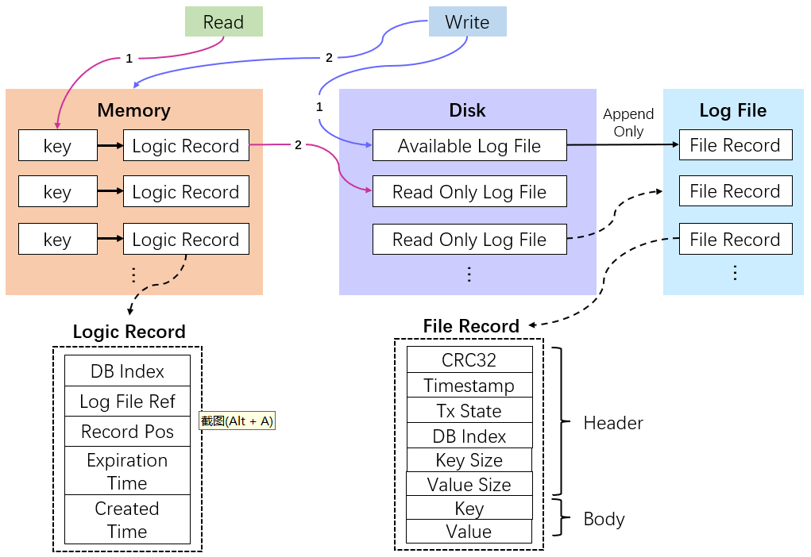
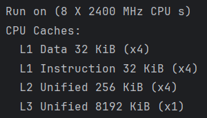
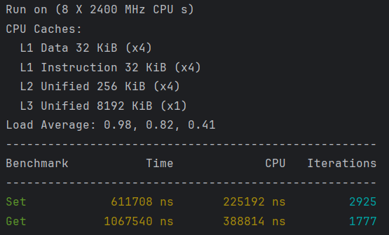
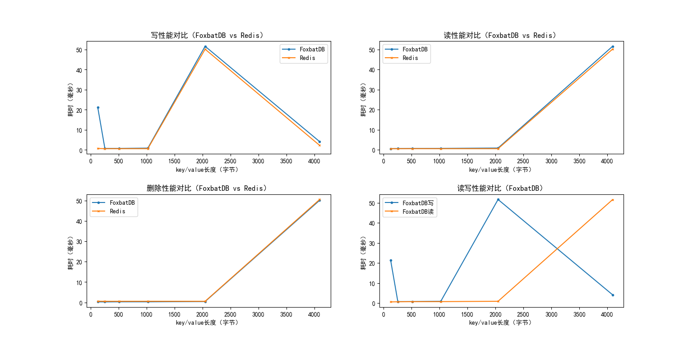

# FoxbatDB

轻量级K-V数据库：支持事务ACID、兼容Redis命令

* [主要特点](#1-主要特点)
* [设计概述](#2-设计概述)
* [快速开始](#3-快速开始)
* [性能分析](#4-性能分析)

## 1 主要特点

### 1.1 优势

* 跨平台
* 读写性能接近Redis
* crash-safe
* 支持事务ACID
* 支持key前缀模糊匹配
* 崩溃恢复、数据备份或迁移操作简单
* 使用RESP 3协议与客户端通信，兼容Redis命令，可直接使用现有的Redis客户端

### 1.2 不足

* 所有key均维护在内存中

## 2 设计概述

### 2.1 内存索引结构

FoxbatDB内存索引结构采用字典树（Trie树），以实现key的前缀模糊快速匹配；
此外，为了解决普通Trie占用内存过多的问题，采用基于burst-trie原理实现的HAT-trie[<sup>[1]</sup>](#refer-anchor-1)
作为实际的内存索引结构。  


### 2.2 磁盘存储结构

FoxbatDB磁盘数据存储使用预写日志（Write Ahead Log），
数据日志文件为只追加写入（append-only）文件，以获得较佳的写入性能。
存储策略参考Bitcask[<sup>[2]</sup>](#refer-anchor-2)实现。


### 2.3 事务

FoxbatDB事务可视为Redis事务的ACID扩展，与Redis共用事务命令，但保证ACID：

* 原子性（Atomic）：若事务包含写操作，一旦事务执行期间发生错误，将自动回滚
* 隔离性（Isolation）：通过Watch乐观锁机制实现，与Redis一致
* 持久性（Durability）：若事务包含写操作，将在执行期间将事务执行状态和写入数据一起持久化到磁盘上（File Record结构中的Tx
  State）
* 一致性（Consistency）：在加载历史数据时，通过检查记录的事务执行状态，保证即使事务执行期间系统故障也能将数据库恢复到确定状态

### 2.4 性能优化策略

* CPU缓存优化：需要频繁使用的数据结构，其内存均对齐CPU L1缓存行大小
* 内存使用优化：需频繁创建/销毁的数据结构，实现其专用的对象池，以减少内存碎片和动态内存分配/释放的开销

## 3 快速开始

### 3.1 支持的命令
### 3.1.1 Redis命令
* 数据库操作
  - SELECT
  - HELLO
  - MOVE
* 事务
  - MULTI
  - EXEC
  - DISCARD
  - WATCH
  - UNWATCH
* 发布-订阅模式
  - PUBLISH
  - SUBSCRIBE
  - UNSUBSCRIBE
* Key-Value操作
  - 读
    - GET
    - EXISTS
    - GETRANGE
    - MGET
    - STRLEN
    - TTL
    - PTTL
  - 写
    - SET
    - MSET
    - APPEND
  - 删
    - DEL
  - 改
    - RENAME
    - INCR
    - DECR
    - INCRBY
    - DECRBY
    - INCRBYFLOAT

### 3.1.2 扩展命令命令
* MERGE：合并磁盘上的数据日志文件；成功时返回OK，失败时返回具体错误
* PREFIX：查询符合特定前缀的Key-Value；以数组格式(key1, value1, key2, value2....)返回匹配的Key-Value

### 3.2 安装

#### 3.2.1 从源码构建
* Linux/Mac OS

```shell
mkdir build
cd build
cmake ..
make
```

* Windows  
  [Micoosoft官方文档：编译CMake项目](https://learn.microsoft.com/en-us/cpp/build/cmake-projects-in-visual-studio?view=msvc-170)

## 4 性能分析

### 4.1 测试条件

* 操作系统：Ubuntu 22.04
* 编译器：gcc 11.4.0，开启O3优化
* 机器性能  
  

### 4.2 读写性能

* 使用[google/benchmark](https://github.com/google/benchmark)进行性能测试
* 测试文件为test/benchmark/benchmark.cc  
  

### 4.3 与Redis对比

* Redis各项设置均保持默认，版本为7.2.2
* 对每一条命令，均运行100次，统计耗时平均值
* 测试脚本为test/benchmark/compare_redis.py
  

## 参考

<div id="refer-anchor-1"></div>

[1] [Askitis N, Sinha R. HAT-trie: a cache-conscious trie-based data structure for strings[C]//ACSC. 2007, 97: 105.](https://d1wqtxts1xzle7.cloudfront.net/65965420/CRPITV62Askitis-libre.pdf?1615412661=&response-content-disposition=inline%3B+filename%3DHAT_Trie_A_Cache_Conscious_Trie_Based_Da.pdf&Expires=1705206514&Signature=N5Zff-G1FTsDEfjE5-RwT5J9nSA~i89PIBE2SXBjFrQ-goCLiRHtcB7XbvpMxJsBpkZ5JvR75WwiMsAzVwOAr85FVoFwsICUmwZ-EFoKlzeKml~QxzDD7X8MKFPk3-8OP5RqycwcL~9-KoT8J-JUkoTRX-5ZV9qBX70LEOqI6E8VMwHrER05zf7VSQKwmEnVLYlV9imhy0InxCKLc-4e50xrIt4D96b0QZNqJf~dnsrxpSdVz9mfLQU8QYNnOvgCH77utQhCRvh~jL~GVKdGcWxYO0Z3WcndJ5GGtpvCDSmEaG4u-beoMkRKosDFX~v0iis7UNlO8Uh0hrPSWPusdQ__&Key-Pair-Id=APKAJLOHF5GGSLRBV4ZA)

<div id="refer-anchor-2"></div>

[2] [Sheehy J, Smith D. Bitcask: A log-structured hash table for fast key/value data[J]. Basho White Paper, 2010.](https://riak.com/assets/bitcask-intro.pdf)
