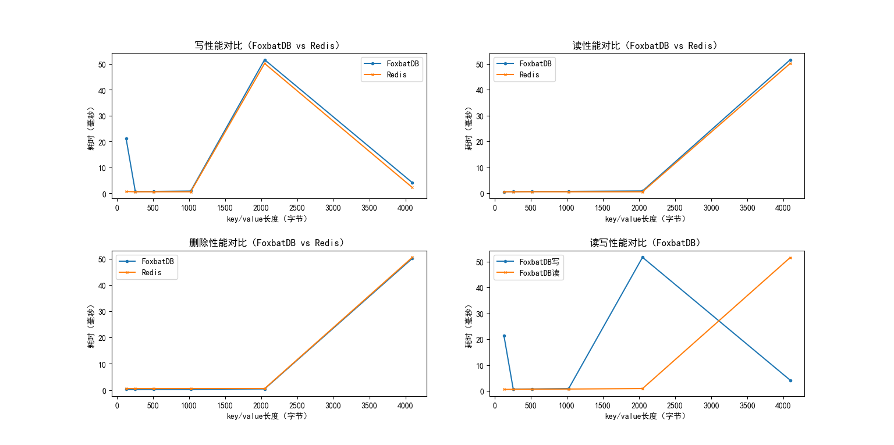

# FoxbatDB

A lightweight Key-Value Database: supports ACID transactions, compatible with Redis commands

* [Main Features](#1-main-features)
* [Design Overview](#2-design-overview)
* [Quick Start](#3-quick-start)
* [Performance Analysis](#4-performance-analysis)

## 1 Main Features

### 1.1 Advantages

* Cross-platform
* Read/write performance close to Redis
* Crash-safe
* Supports ACID transactions
* Supports fuzzy matching of key prefixes
* Simple crash recovery, data backup, or migration operations
* Communicates with clients using RESP 3 protocol, compatible with Redis commands, can directly use existing Redis
  clients

### 1.2 Limitations

* All keys are maintained in memory

## 2 Design Overview

### 2.1 Memory Index Structure

FoxbatDB's memory index structure uses a trie tree to achieve fast fuzzy matching of key prefixes;
In addition, to address the problem of excessive memory consumption by ordinary tries, it adopts a HAT-trie implemented
based on the burst-trie principle[<sup>[1]</sup>](#refer-anchor-1)
as the actual memory index structure.  


### 2.2 Disk Storage Structure

FoxbatDB's disk data storage uses a Write Ahead Log (WAL),
the data log file is an append-only file to achieve better write performance.
The storage strategy refers to the implementation of Bitcask[<sup>[2]</sup>](#refer-anchor-2).


### 2.3 Transactions

FoxbatDB transactions can be viewed as an ACID extension of Redis transactions, sharing transaction commands with Redis,
but guaranteeing ACID:

* Atomicity: If the transaction contains write operations, it will automatically roll back if an error occurs during
  transaction execution.
* Isolation: Achieved through the Watch optimistic lock mechanism, consistent with Redis.
* Durability: If the transaction contains write operations, the transaction execution status and written data will be
  persisted to disk during execution (Tx State in the File Record structure).
* Consistency: When loading historical data, check the transaction execution status recorded to ensure that the database
  can be restored to a consistent state even if a system failure occurs during transaction execution.

### 2.4 Performance Optimization Strategies

* CPU cache optimization: Data structures that need to be frequently accessed are aligned with the CPU L1 cache line
  size.
* Memory usage optimization: For data structures that need to be frequently created/destroyed, implement dedicated
  object pools to reduce memory fragmentation and overhead of dynamic memory allocation/deallocation.

## 3 Quick Start

### 3.1 Supported Commands

### 3.1.1 Redis Commands

* Database operations
    - SELECT
    - HELLO
    - MOVE
* Transactions
    - MULTI
    - EXEC
    - DISCARD
    - WATCH
    - UNWATCH
* Publish-Subscribe pattern
    - PUBLISH
    - SUBSCRIBE
    - UNSUBSCRIBE
* Key-Value operations
    - Read
        - GET
        - EXISTS
        - GETRANGE
        - MGET
        - STRLEN
        - TTL
        - PTTL
    - Write
        - SET
        - MSET
        - APPEND
    - Delete
        - DEL
    - Modify
        - RENAME
        - INCR
        - DECR
        - INCRBY
        - DECRBY
        - INCRBYFLOAT

### 3.1.2 Extended Commands

* MERGE: Merge data log files on disk; returns OK on success, returns specific error on failure
* PREFIX: Query Key-Value pairs matching specific prefixes; returns matching Key-Value pairs in array format (key1,
  value1, key2, value2....)

### 3.2 Installation

#### 3.2.1 Build from Source

* Linux/Mac OS

```shell
mkdir build
cd build
cmake ..
make
```

* Windows  
  [Microsoft Official Documentation: Compiling CMake Projects](https://learn.microsoft.com/en-us/cpp/build/cmake-projects-in-visual-studio?view=msvc-170)

## 4 Performance Analysis

### 4.1 Test Conditions

* Operating System: Ubuntu 22.04
* Compiler: gcc 11.4.0 with O3 optimization enabled
* Machine Specifications  
  

### 4.2 Read/Write Performance

* Performance testing conducted using [google/benchmark](https://github.com/google/benchmark)
  

### 4.3 Comparison with Redis

* Redis configurations kept at default, version 7.2.2
* Each command run 100 times, average time consumption recorded
* Testing script: test/benchmark/compare_redis.py
  

*Clockwise, the performance comparisons are: write performance comparison, read performance comparison, read/write
performance comparison, and delete performance comparison.*

## References

<div id="refer-anchor-1"></div>

[1] [Askitis N, Sinha R. HAT-trie: a cache-conscious trie-based data structure for strings[C]//ACSC. 2007, 97: 105.](https://d1wqtxts1xzle7.cloudfront.net/65965420/CRPITV62Askitis-libre.pdf?1615412661=&response-content-disposition=inline%3B+filename%3DHAT_Trie_A_Cache_Conscious_Trie_Based_Da.pdf&Expires=1705206514&Signature=N5Zff-G1FTsDEfjE5-RwT5J9nSA~i89PIBE2SXBjFrQ-goCLiRHtcB7XbvpMxJsBpkZ5JvR75WwiMsAzVwOAr85FVoFwsICUmwZ-EFoKlzeKml~QxzDD7X8MKFPk3-8OP5RqycwcL~9-KoT8J-JUkoTRX-5ZV9qBX70LEOqI6E8VMwHrER05zf7VSQKwmEnVLYlV9imhy0InxCKLc-4e50xrIt4D96b0QZNqJf~dnsrxpSdVz9mfLQU8QYNnOvgCH77utQhCRvh~jL~GVKdGcWxYO0Z3WcndJ5GGtpvCDSmEaG4u-beoMkRKosDFX~v0iis7UNlO8Uh0hrPSWPusdQ__&Key-Pair-Id=APKAJLOHF5GGSLRBV4ZA)

<div id="refer-anchor-2"></div>

[2] [Sheehy J, Smith D. Bitcask: A log-structured hash table for fast key/value data[J]. Basho White Paper, 2010.](https://riak.com/assets/bitcask-intro.pdf)
